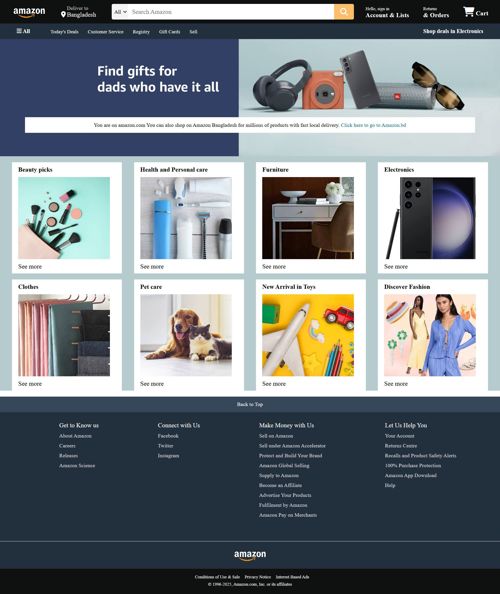

## 🛒 Amazon Clone  

A visually appealing and responsive **Amazon landing page clone** built using **HTML**, **CSS**. This project replicates the look and feel of the original Amazon homepage, showcasing modern UI practices and layout techniques.

---

## 🚀 Features  
- ✅ Fully responsive Amazon-like homepage layout  
- ✅ Header with search bar, cart icon, and navigation links  
- ✅ Product cards styled similarly to Amazon  
- ✅ Hover effects and smooth transitions  
- ✅ Clean and well-structured code  

---

## 🛠 Tech Stack  
- **HTML**  
- **CSS** 

---

## 📷 Screenshots  
  

---

## 📌 How It Works  
1. This is a static front-end **UI clone** of Amazon's homepage.  
2. All sections are carefully crafted to resemble the real Amazon site.  
3. You can customize it to add dynamic product loading, authentication, or a backend in the future.

---

